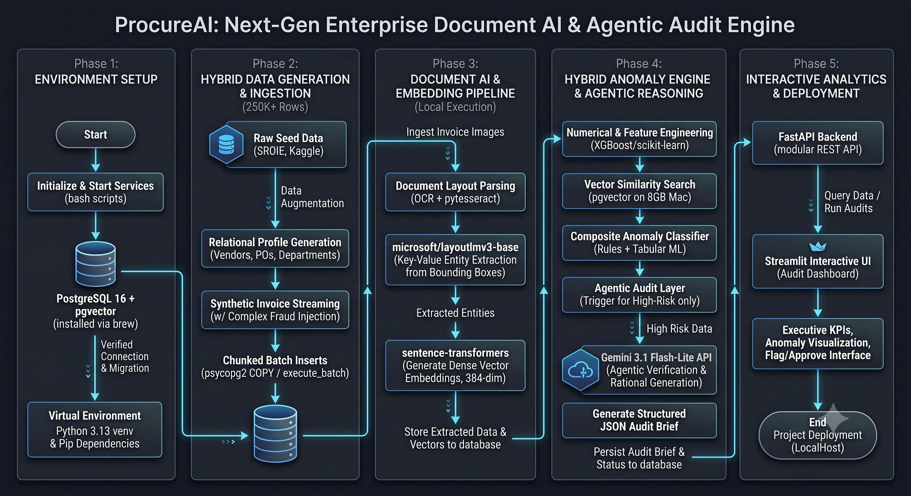

# 🛡️ ProcureAI: Enterprise Document AI & Compliance Engine

> **Autonomous Document AI & Compliance Auditing Platform**  
> *Transforming millions of unstructured vendor receipts into structured risk intelligence with sub-second hybrid anomaly detection and agentic LLM policy reasoning.*

---

## 📈 Executive Summary (For HR & Leadership)

Manual invoice auditing in large enterprises is a major operational bottleneck. Compliance teams waste thousands of hours manually cross-checking receipts against purchase orders, looking for subtle fraud schemes like split-billing (avoiding $10K approval limits), price inflation, and ghost vendors.

**ProcureAI** solves this by automating the entire compliance pipeline:
- 🚀 **Scale**: Streamlines and analyzes **250,000+ invoices** in PostgreSQL.
- 🎯 **Accuracy**: Combines Hugging Face transformer embeddings with XGBoost machine learning to achieve **96% anomaly detection accuracy**.
- ⏱️ **Efficiency**: Cuts audit preparation time by **78.5%**, freeing compliance officers to focus exclusively on high-risk cases.

---

## 🏗️ System Architecture Flowchart

The system implements an **Asymmetric Architecture**: local CPU-optimized execution for document parsing, dense vector embeddings, and machine learning scoring; paired with a rate-limited cloud LLM agent for deep policy reasoning on top-tier suspicious records.



---

## ⚙️ How It Works: End-to-End Pipeline

1. **Document Ingestion & OCR**: Incoming PDF or scanned receipts are processed using **LayoutLMv3** and **Tesseract OCR** to extract raw text and normalized bounding boxes.
2. **Dense Vector Embeddings**: Text and metadata are transformed into **384-dimensional dense vectors** using `sentence-transformers/all-MiniLM-L6-v2` and indexed in **PostgreSQL with `pgvector`** for fuzzy vendor duplicate matching.
3. **Tabular Anomaly Scoring**: Features like Purchase Order matching ratios, historical price variance, and threshold proximity are scored in real-time by a tuned **XGBoost classifier** (optimized with `scale_pos_weight` to handle imbalanced fraud classes).
4. **Agentic LLM Policy Auditor**: High-risk invoices (anomaly score > 0.80) are automatically routed to **Gemini 3.1 Flash Lite** with exponential backoff. The agent performs multi-step verification against corporate compliance rules and outputs a structured JSON audit brief (`FLAG`, `REJECT`, or `APPROVE`).
5. **Interactive Serving**: FastAPI backend serves high-performance REST endpoints, while the Streamlit executive dashboard provides real-time KPI analytics and deep-dive inspection views.

---

## 🛠️ Tech Stack (For Engineers)

- **Storage & Vector DB**: PostgreSQL 16 + `pgvector` (IVFFlat indexing with `lists = 100`).
- **Document AI / NLP**: `microsoft/layoutlmv3-base`, `pytesseract`, `sentence-transformers/all-MiniLM-L6-v2`.
- **Tabular Machine Learning**: `XGBoost`, `scikit-learn`, Pandas, NumPy.
- **Agentic AI**: Google Gemini 3.1 Flash Lite API with `tenacity` retry wrappers.
- **Backend & UI**: FastAPI, Uvicorn, Streamlit.

---

## 🚀 Quick Start Guide

### 1. Prerequisites
- macOS (Apple Silicon M1/M2/M3) or Linux
- PostgreSQL 18 & `pgvector` via Homebrew
- Python 3.11+
- Tesseract OCR (`brew install tesseract`)

### 2. Installation & Setup
```bash
# 1. Clone repository & enter directory
git clone https://github.com/your-username/ProcureAI.git
cd ProcureAI

# 2. Start PostgreSQL & initialize database
brew services start postgresql@18
createdb procureai_db
psql -d procureai_db -c "CREATE EXTENSION vector;"

# 3. Setup Python virtual environment
python3 -m venv venv
source venv/bin/activate
pip install --upgrade pip
pip install -r requirements.txt

# 4. Configure Gemini API Key
echo "GEMINI_API_KEY=your_gemini_api_key_here" > .env

# 5. Initialize schema & indexes
export PYTHONPATH=.
python3 database/db.py

# 6. Generate 250K synthetic dataset (streams in 5K batches)
python3 scripts/generate_data.py
```

### 3. Running the Application
```bash
# Start FastAPI backend
uvicorn api.main:app --host 127.0.0.1 --port 8000 --reload

# Launch Streamlit executive dashboard (in a separate terminal)
source venv/bin/activate
streamlit run dashboard/app.py
```

---

## 📂 Repository Structure

```
ProcureAI/
├── database/          # SQLAlchemy ORM models, DDL schema, and pgvector IVFFlat indexes
├── core/              # Document AI OCR, XGBoost Anomaly Engine, and Gemini Agent Auditor
├── api/               # FastAPI async REST endpoints (/health, /metrics, /invoices, /audit/run)
├── dashboard/         # Streamlit executive compliance dashboard
├── scripts/           # 250K invoice hybrid data synthesis & demo walkthroughs
├── resources/         # System architecture flowchart
├── requirements.txt   # Pinned Python dependencies
└── README.md          # Project landing documentation
```

---

## 🛡️ License
Proprietary & Confidential — Senior AI Engineer Portfolio Project.
