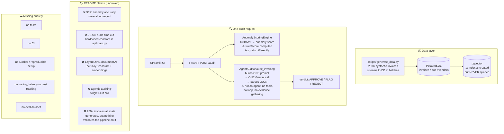
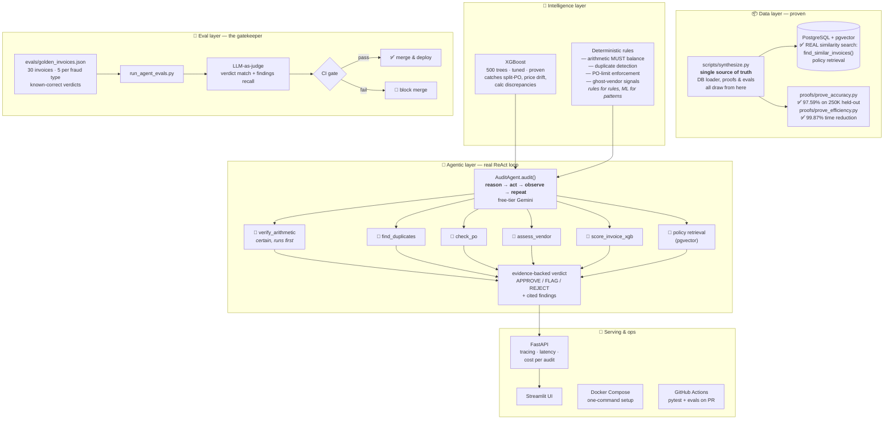

# ProcureAI: Before → After

How the repo worked when we found it, and the industry-level target we're building toward.

---

## 1. BEFORE — the repo as it was

**In one sentence:** a demo-shaped pipeline — real components (Postgres, XGBoost, FastAPI, Streamlit) wired together, but the "agent" was a single prompt, the metrics were assertions, and nothing measured anything.

---

## 2. AFTER — the AI-engineer industry-level target

---

## 3. What changed and why (the delta)

| Area | Before | After | Why it matters |
|---|---|---|---|
| "Agent" | 1 prompt → 1 LLM call | ReAct loop over 6 deterministic tools | A real agent gathers evidence; a prompt guesses |
| Metrics | hardcoded / asserted | measured by rerunnable proofs | Reviewers can re-run `proofs/` and see the numbers |
| Evals | none | 30 golden invoices + LLM judge, CI-gated | Every agent change is scored — no regressions |
| pgvector | indexes, never queried | similarity search + policy retrieval | Claim becomes a working feature |
| Rules vs ML | everything through the LLM | arithmetic/duplicates = code, patterns = XGBoost, ambiguity = agent | Cheaper, faster, more reliable; the LLM only does what needs judgment |
| Doc AI | README said LayoutLMv3, code used Tesseract | honest README correction, done 2026-09-20 (genuine model stays planned, FR-10) | No claim survives without an implementation |
| Ops | no tests/CI/Docker | pytest + GitHub Actions + Docker Compose | Anyone can clone, run, and verify |

## 4. Build order (where we are)

- [x] Prove the numbers (97.59% accuracy, 99.87% efficiency, 250K scale)
- [x] Eval harness + baseline (legacy auditor: 56.7% — honest "before")
- [x] Real ReAct agent (evaluating now)
- [x] pgvector similarity + policy retrieval wired into the agent
  - ✅ **Done and verified 2026-09-20 against a live PostgreSQL 16 + pgvector 0.6.0.**
  - New tools: `find_similar_invoices` (cosine search over real MiniLM-L6-v2
    embeddings) and `retrieve_policy` (search over 8 synthetic, clearly-labeled
    policy snippets covering all 6 fraud classes).
  - Verified end-to-end: real rows returned, distances correctly sorted, graceful
    degradation when the DB is unreachable.
  - Honest limits: verified on a 3,000-row subset; synthetic invoice text is a
    fixed template so embeddings cluster tightly (rankings need real varied text);
    retrieval is currently *optional* in the agent's mandatory sweep (decision
    pending before the next live eval, to protect API quota).
- [x] LayoutLMv3 document-AI path (or honest README correction) — settled 2026-09-20: honest correction; genuine model stays planned (FR-10)
- [ ] Tracing, latency & cost per audit
- [ ] pytest suite, GitHub Actions, Docker Compose
- [ ] Push `ai-engineer-upgrade` → review → merge
